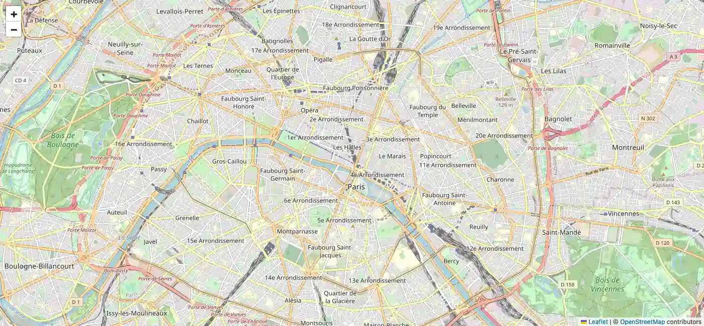
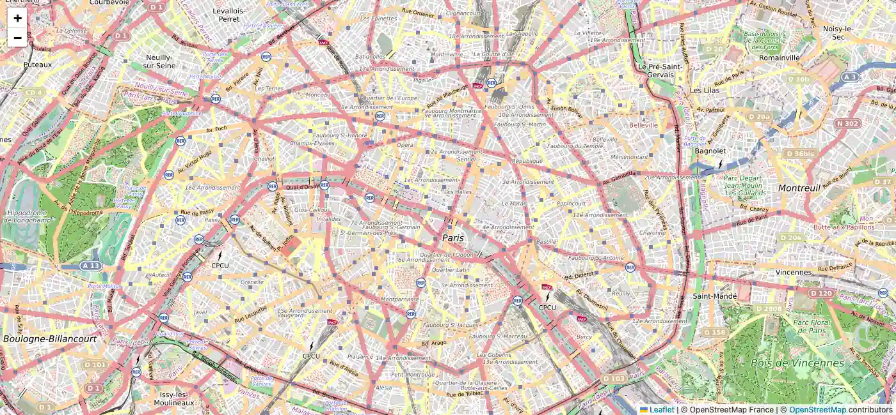
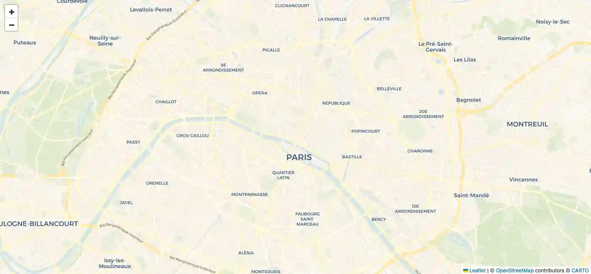
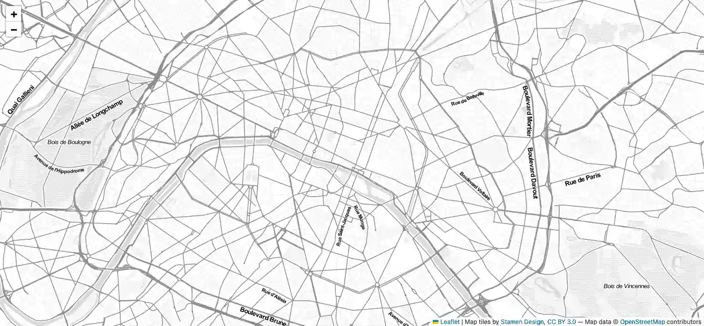
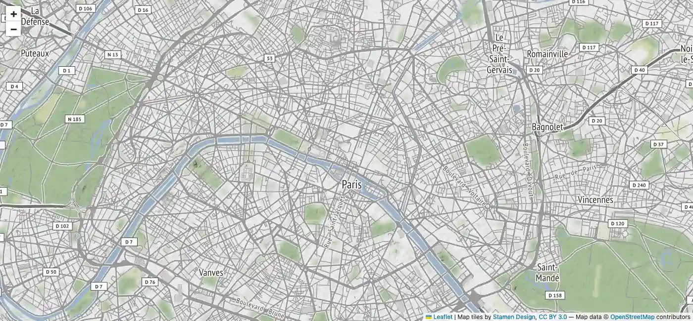

# <abbr title="Standalone EmbEddable Map">SEEMAP</abbr> for Standalone EmbEddabl Map

Popular Leaflet plugins and map providers bundled into a single customizable HTML file with its API.

Embed Leaflet/OSM maps on your own server using a single HTML file with customizable settings overridable through URL GET parameters. 

<abbr title="Standalone EmbEddable Map">SEEMAP</abbr> is helper for [Leaflet.js](https://leafletjs.com/) accessible from URL GET parameters.

Set your own default settings in sem.defaults and override it through URL GET parameters if needed.

SEEMAP concatenates the following resources into a single HTML file to bring a simple UI/API helper interface:

* [Leaflet.js](https://leafletjs.com/) an open-source JavaScript library
for mobile-friendly interactive maps
* [Leaflet Gesture Handling](https://github.com/elmarquis/Leaflet.GestureHandling) Brings the basic functionality of Google Maps Gesture Handling into Leaflet. Prevents users from getting trapped on the map when scrolling a long page. 
* [Leaflet Marker Cluster](https://github.com/Leaflet/Leaflet.markercluster) Provides Beautiful Animated Marker Clustering functionality for Leaflet, a JS library for interactive maps.
* [Leaflet Routing Machine](https://github.com/perliedman/leaflet-routing-machine) or [Official website](https://www.liedman.net/leaflet-routing-machine/) Provides Beautiful Animated Marker Clustering functionality for Leaflet, a JS library for interactive maps.
* [LeafLet Providers](https://github.com/leaflet-extras/leaflet-providers) An extension to Leaflet that contains configurations for various free tile providers. The following included tiles providers work without API key:
    * [OpenStreetMap_Mapnik](https://olivier3lanc.github.io/standalone-embeddable-map/)<br>
    * [OpenStreetMap_France](https://olivier3lanc.github.io/standalone-embeddable-map/?layer=OpenStreetMap_France)<br>
    * [CartoDB_Voyager](https://olivier3lanc.github.io/standalone-embeddable-map/?layer=CartoDB_Voyager)<br>
    * [Stamen_TonerLite](https://olivier3lanc.github.io/standalone-embeddable-map/?layer=Stamen_TonerLite)<br>
    * [Stamen_Terrain](https://olivier3lanc.github.io/standalone-embeddable-map/?layer=Stamen_Terrain)<br>


## Key features

* **Single file**<br> Only one HTML file is necessary
* **Iframe**<br> Include the SEEMAP file as *iframe* anywhere on your pages
* **Customizable settings**<br> Set your own settings, override it to your needs through URL GET parameters.
* **Markers**<br> Add as much markers with latitude and longitude through URL GET parameters.
* **Marker clusters**<br> When markers density is to high, provides beautiful animated marker clustering.
* **Gesture handling**<br> Brings the basic functionality of Google Maps Gesture Handling into Leaflet. Prevents users from getting trapped on the map when scrolling a long page. 
* **Routing Machine**<br> Easy way to get distance between multiple markers.

## Installation

Download index.html, rename if needed, use it as iframe tag or and embed SEEMAP is supposed to be included as an iframe:

```html
<iframe src="../seemap.html"></iframe>
<!-- DEMO ONLY -->
<style>
    iframe {
        position: fixed;
        top: 0;
        left: 0;
        width: 100%;
        height: 100%;
        border: none;
    }
</style>
```
{:.playground title="Installation"}

## Markers

Add as much markers as you want through URL GET parameters.

### Simple marker

```html
[SEEMAP_URL]?marker=<lat>,<lng>[,<popup content>]
```

[Simple marker example](https://olivier3lanc.github.io/standalone-embeddable-map/?marker=48.85830,2.29435)

```html
<iframe src="../seemap.html?marker=48.85830,2.29435"></iframe>
<!-- DEMO ONLY -->
<style>
    iframe {
        position: fixed;
        top: 0;
        left: 0;
        width: 100%;
        height: 100%;
        border: none;
    }
</style>
```
{:.playground title="Simple marker"}

### Multiple markers

Multiple markers are automatically clustered.

```html
[SEEMAP_URL]?marker=<lat1>,<lng1>[,<popup content 1>]&marker=<lat2>,<lng2>[,<popup content 2>]...
```

[Multiple markers example](https://olivier3lanc.github.io/standalone-embeddable-map/?marker=48.85830,2.29435,Paris&marker=45.7560,4.8340,Lyon&marker=43.2962,5.3696,Marseille)

```html
<iframe src="../seemap.html?marker=48.85830,2.29435,Paris&marker=45.7560,4.8340,Lyon&marker=43.2962,5.3696,Marseille"></iframe>
<!-- DEMO ONLY -->
<style>
    iframe {
        position: fixed;
        top: 0;
        left: 0;
        width: 100%;
        height: 100%;
        border: none;
    }
</style>
```
{:.playground title="Multiple marker"}