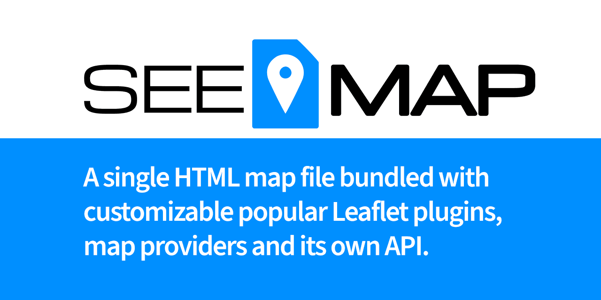

# SEEMAP

[Documentation and demos](https://olivier3lanc.github.io/seemap/)



<abbr title="Standalone EmbEddable Map">SEEMAP</abbr> *for Standalone EmbEddable Map* is **a single HTML file** bundled of useful and popular Leaflet/OpenStreetMap resources in a easy way to embed.

| Description |  |
| :- | :- |
| Installation and usage | [Download page](https://olivier3lanc.github.io/seemap/installation.html) |
| Settings | [Settings](https://olivier3lanc.github.io/seemap/settings.html) |
| Uncompressed page size | **1.6Mb** |
| Compressed page size (through HTTP2 or ZIP) | **190Kb** |
| Typical embed size through an iframe (with tiles) | **500Kb** |
| PageSpeed Insights test on mobile | [Test now](https://pagespeed.web.dev/report?url=https%3A%2F%2Folivier3lanc.github.io%2Fseemap%2Fseemap.html&form_factor=mobile) |
| PageSpeed Insights test on desktop | [Test now](https://pagespeed.web.dev/report?url=https%3A%2F%2Folivier3lanc.github.io%2Fseemap%2Fseemap.html&form_factor=desktop) |

## Main features

* **One single HTML file** <br>Ready to embed via *iframe* tag or directly through the browser, every feature is included. [Learn more](https://olivier3lanc.github.io/seemap/)<br><br>
* **Customizable** <br>Set your own default [settings](https://olivier3lanc.github.io/seemap/settings.html).<br><br>
* **API through URL GET parameters** <br>Override your default parameters through [URL GET parameters](https://olivier3lanc.github.io/seemap/api.html).<br><br>
* **View** <br>Set a default [view](https://olivier3lanc.github.io/seemap/view.html) and override the map geographical center through [API](https://olivier3lanc.github.io/seemap/api.html)<br><br>
* **Markers** <br>Add as much markers with latitude and longitude through URL GET parameters. [Learn more](https://olivier3lanc.github.io/seemap/markers.html)<br><br>
* **Marker clusters** <br>When markers density is to high, provides beautiful animated marker clustering. [Learn more](https://olivier3lanc.github.io/seemap/markers-clusters.html)<br><br>
* **Gesture handling** <br>Brings the basic functionality of Google Maps Gesture Handling into Leaflet. Prevents users from getting trapped on the map when scrolling a long page. [Learn more](https://olivier3lanc.github.io/seemap/gesture-handling.html)<br><br>
* **Routing Machine** <br>Easy way to get distance and itinerary between multiple markers. [Learn more](https://olivier3lanc.github.io/seemap/routing.html)<br><br>
* **Autocomplete** <br>OpenStreetMap search engine available into a simple autocompletion list. [Learn more](https://olivier3lanc.github.io/seemap/autocomplete.html)<br><br>

## Quick start

[Installation](https://olivier3lanc.github.io/seemap/installation.html) | [Settings](https://olivier3lanc.github.io/seemap/settings.html)

Just include SEEMAP as an iframe as follows:

```html
<iframe src="path/to/seemap.html"></iframe>
```

## Credits

List of libraries and resources SEEMAP could not exist without!

* [Leaflet.js](https://leafletjs.com/) an open-source JavaScript library
for mobile-friendly interactive maps
* [OpenStreetMap](https://www.openstreetmap.org) OpenStreetMap is the free wiki world map.
* [Leaflet Gesture Handling](https://github.com/elmarquis/Leaflet.GestureHandling) Brings the basic functionality of Google Maps Gesture Handling into Leaflet. Prevents users from getting trapped on the map when scrolling a long page. 
* [Leaflet Marker Cluster](https://github.com/Leaflet/Leaflet.markercluster) Provides Beautiful Animated Marker Clustering functionality for Leaflet, a JS library for interactive maps.
* [Leaflet Routing Machine](https://github.com/perliedman/leaflet-routing-machine) or [Official website](https://www.liedman.net/leaflet-routing-machine/) Control for routing in Leaflet based on [OSRM - Open Source Routing Machine](http://map.project-osrm.org)
* [Leaflet.Autocomplete](https://github.com/tomik23/Leaflet.Autocomplete) OpenStreetMap search engine available into a simple autocompletion list.
* [OpenStreetMap search engine](https://nominatim.openstreetmap.org/ui/search.html) the search engine used on the OpenStreetMap website.
* [LeafLet Providers](https://github.com/leaflet-extras/leaflet-providers) An extension to Leaflet that contains configurations for various free and paid tile providers.
* [Feather Icons](https://feathericons.com/) Simply beautiful open source icons.

